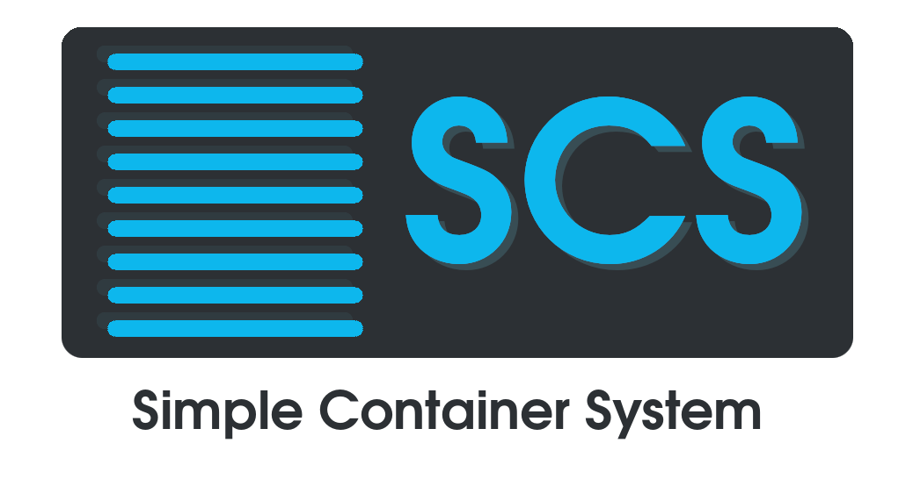

# Simple Container System - SCS
A simple system based on Docker containers with DNS, Apache/PHP, MySQL and Postfix for internal networks. (testing)

# Introduction
Simple Container System is a container based project.

It's designed to be a simple and easily configurable containerized system.

This environment need to be deployed in a local network.

# Images and Containers
The project contains personalized images and containers.

## DNS Container
A BIND9 server with predefined names and IPs for the internal Docker network and also be useful in the external network.

## Apache/PHP and MySQL Containers
An Apache/PHP web server.

It use a MySQL server container.

# Simple Container Utils
Simple Container System also provides a set of scripts to auto-install, start, stop, remove and perform backups of the containers.

# Install Simple Container System
## Install Docker Engine
First you need to install Docker Engine. Follow the Docker instructions here for your system:
- Desktop: https://docs.docker.com/engine/install/#server
- Server (prefered): https://docs.docker.com/engine/install/#server

## Autoinstallation of Simple Container System
Once you have downloaded Docker, download the repository folder. You can clone the repository from the command line or downloading fom the GitHub website.
```
git clone samuelrollon/Simple-Container-System-SCS
```

Then go to `scs-utils` folder under the root directory of the project.

Run the autoinstallation script and wait for the system to install and start.
```
bash scs-autoinstall
```

You can check the containers status with the following command.
```
sudo docker ps
```